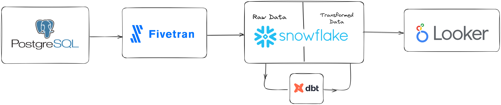
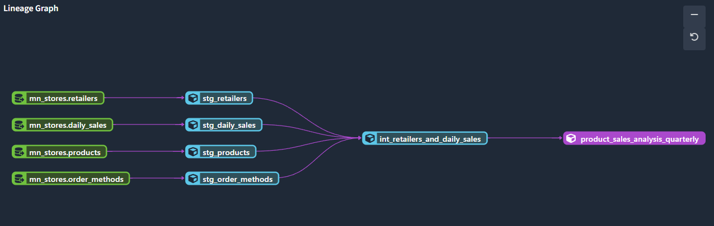
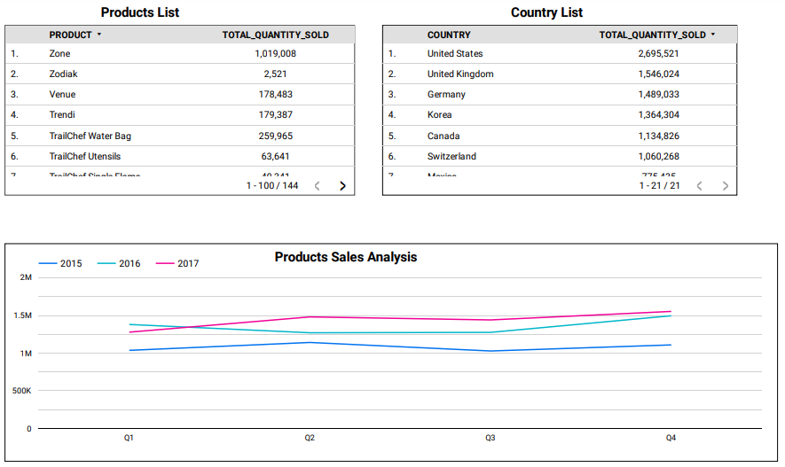

## Fivetran Snowflake DBT Looker Deployment.

### Fivetran
- Data Extraction Tool
- Source: Postgresql
- Destination: Snowflake

### Snowflake
- Data warehouse for Analytics 

### DBT
- Transformed raw data to structured data in Snowflake Data warehouse.
- Modelling Data in Snowflake Ready for Analysis
  

### Looker:
- Modelled and Structured data is integrated into Looker for Analysis.
- Real-time Product Analysis [click_here](https://lookerstudio.google.com/reporting/df93d4f9-ef3e-45fe-86a5-470c69b697e0) in Looker.
  
  

